# 🏦 SafePay Enterprise


> **High-Performance Fintech Simulation:** Payment processing and digital wallet system with event-driven architecture, asynchronous processing, and real-time monitoring.

---

## 📖 About the Project

**SafePay** is a robust platform developed to simulate real-world scenarios of a financial institution. The project's focus is not just processing payments, but ensuring **resilience, atomicity, and observability**.

Using a modern architecture based on microservices and containers, the system can handle high transaction loads, automatically handle failures (DLQ), and provide instant feedback to users via WebSockets.

### 🎯 Key Differentiators

* **Asynchronous Processing:** Background jobs with RabbitMQ to avoid blocking users
* **Total Resilience:** Dead Letter Queue (DLQ) for automatic failure recovery
* **Real-Time:** Native WebSockets with Laravel Reverb for instant feedback
* **Financial Security:** ACID transactions with pessimistic locking
* **Observability:** Administrative dashboard with live metrics

---

## ✨ Core Features

### 💳 Digital Wallet

Complete financial management system:
* 💰 **Deposits:** Top-up system with asynchronous processing
* 📊 **Balance Inquiry:** Real-time view with intelligent caching
* 📜 **Detailed Statement:** Complete transaction history with advanced filters

### ⚡ Asynchronous Payment Processing

Payments are processed in **background via RabbitMQ queues**, ensuring:
* ✅ Immediate response to user (non-blocking)
* ✅ Higher throughput and scalability
* ✅ Failure isolation (one failed payment doesn't affect others)

### 🔄 Hybrid Payment Gateways

SafePay supports multiple payment methods, each with specific characteristics:

#### 💳 Credit Card
* External gateway delay simulation (realistic latency)
* Asynchronous processing with automatic retry
* Card data validation

#### 👛 Account Balance
* **Atomic transactions** with Database Lock 
* Negative balance prevention guaranteed at database level
* Optimized performance for high volume

#### 💸 Pix (Instant Payment)
* Instant processing
* **Automatic cashback** on eligible payments
* Simulated integration with settlement system

### 🎁 Cashback and Redemption System

* 📈 **Automatic Accumulation:** Cashback credited on qualified transactions
* 💰 **Conversion to Real Balance:** Direct redemption to wallet
* 🎯 **Customizable Rules:** Configurable percentages and eligibility

### 🛡️ Resilience and Dead Letter Queue (DLQ)

Intelligent failure handling:

1. **Automatic Detection:** Failed jobs are identified immediately
2. **Retry Attempts:** Automatic reprocessing with exponential backoff
3. **DLQ Storage:** Messages with persistent errors go to dedicated queue
4. **Dashboard Recovery:** Administrative interface to manually reprocess failures

```
┌─────────────┐      ┌──────────────┐      ┌─────────────┐
│   Payment   │─────>│   RabbitMQ   │─────>│   Worker    │
│   Request   │      │    Queue     │      │  Processing │
└─────────────┘      └──────────────┘      └─────────────┘
                            │                      │
                            │   (Fails after       │
                            │    3 attempts)       │
                            ▼                      ▼
                     ┌──────────────┐      ┌─────────────┐
                     │     DLQ      │◄─────│   Failed    │
                     │  (Recovery)  │      │   Handler   │
                     └──────────────┘      └─────────────┘
```

### 📊 "Enterprise" Dashboard

Administrative interface in **Dark Mode** with advanced features:

* 📈 **Real-Time Metrics:** Updated via Laravel Reverb (WebSockets)
* 💼 **Total Control:** User, transaction, and configuration management
* 🔍 **Audit:** Detailed logs of all financial operations
* 🎮 **Kill Switch:** Simulate critical failures to test resilience

**Available metrics:**
* Transaction volume (minute/hour/day)
* Payment success/failure rate
* Average processing time
* Queue sizes (RabbitMQ)
* Worker status
* Alerts and notifications

---

## 🚀 Technology Stack

The project uses the Laravel ecosystem at its maximum power, orchestrated via Docker:

### Backend
* **Core:** Laravel 11/12 + PHP 8.2+
* **Frontend:** Laravel Livewire 3 + Alpine.js
* **Styling:** TailwindCSS (Native Dark Mode)

### Infrastructure
* **Database:** PostgreSQL 16 (ACID, Transactions, Locks)
* **Cache & Session:** Redis 7 (Look-aside caching)
* **Messaging:** RabbitMQ 3.12 (Queues, Exchanges, DLQ)
* **Streaming:** Apache Kafka (Audit logs and analytics)
* **Real-time:** Laravel Reverb (Native WebSockets)
* **Orchestration:** Docker & Docker Compose

### DevOps
* Nginx (Reverse proxy and load balancer)
* Supervisor (Worker management)
* Docker Networks (Service isolation)

---

## 🏗️ System Architecture

**SafePay** uses an *Event-Driven* architecture to ensure decoupling, high availability, and performance. Data flow is divided between **synchronous** (immediate response) and **asynchronous** (high-performance queues) processing.

### 📊 Architecture Diagram

```mermaid
graph TB
    subgraph "Client"
        User[👤 User]
        Browser[🌐 Browser/Dashboard]
    end
    
    subgraph "Gateway"
        Nginx[⚡ Nginx<br/>Reverse Proxy]
    end
    
    subgraph "Application"
        Laravel[🔷 Laravel API]
        Livewire[⚙️ Livewire UI]
        Middleware[🛡️ Auth/Validation]
    end
    
    subgraph "Asynchronous Processing"
        RabbitMQ[(🐰 RabbitMQ)]
        Worker[⚙️ SafePay Worker<br/>Supervisor]
        DLQ[(📋 Dead Letter Queue)]
    end
    
    subgraph "Persistence"
        Postgres[(🐘 PostgreSQL 16)]
        Redis[(🔴 Redis Cache)]
    end
    
    subgraph "Streaming & Analytics"
        Kafka[(📊 Apache Kafka)]
    end
    
    subgraph "Real-Time"
        Reverb[📡 Laravel Reverb<br/>WebSocket Server]
    end
    
    User --> Browser
    Browser --> Nginx
    Nginx --> Laravel
    Laravel --> Middleware
    
    Middleware --> Livewire
    Middleware --> Postgres
    Middleware --> Redis
    
    Laravel -.Dispatch Job.-> RabbitMQ
    RabbitMQ --> Worker
    Worker --> Postgres
    Worker -.Failure.-> DLQ
    
    Worker -.Event.-> Kafka
    Worker -.Broadcast.-> Reverb
    Reverb -.WebSocket.-> Browser
    
    DLQ -.Reprocess.-> Worker
```



### 🔄 Processing Flows

#### 1. **Synchronous (REST API)**
Nginx receives the request and forwards it to Laravel (PHP-FPM). Simple read operations or validations occur here:
* ✅ Balance inquiry
* ✅ Transaction listing
* ✅ Data validation

**Optimizations:**
* Redis for frequent query caching
* PostgreSQL with optimized indexes
* Connection pooling

#### 2. **Asynchronous (Workers)**
Heavy operations are sent as *Jobs* to **RabbitMQ**:
* 💳 Payment processing
* 💰 Wallet deposits
* 📊 Report generation
* 📧 Notification sending

The `safepay_worker` container (managed by Supervisor) consumes these queues and processes business logic in an **isolated and secure** manner.

#### 3. **Resilience (DLQ)**
If processing fails after N attempts:
* Message is sent to *Dead Letter Queue*
* Detailed log is stored
* Administrator can analyze and reprocess via Dashboard
* **Zero data loss**

#### 4. **Real-Time (Reverb)**
After successful processing:
* Worker fires event to **Laravel Reverb**
* WebSocket sends update to connected client
* Dashboard updates metrics **without refresh (F5)**

---

## 🐳 Docker Services

The infrastructure is orchestrated via Docker Compose, consisting of the following containers:

| Service | Function | Technology | Port |
|:--------|:---------|:-----------|:-----|
| `safepay_app` | Main API and application logic | PHP 8.2+ / Laravel 11 | - |
| `safepay_worker` | Background queue processing | Supervisor / PHP | - |
| `safepay_nginx` | Web server and reverse proxy | Nginx | 8000 |
| `safepay_reverb` | High-performance WebSocket server | Laravel Reverb | 8080 |
| `postgres` | Relational database | PostgreSQL 16 | 5432 |
| `redis` | Cache, Session, and atomic locks | Redis 7 | 6379 |
| `rabbitmq` | Main messaging broker | RabbitMQ 3.12 | 5672, 15672 |
| `kafka` | Event streaming and audit logs | Apache Kafka | 9092 |

---

## 🛡️ Security and Consistency

In a financial context, data integrity and consistency are critical. SafePay addresses these concerns through:

### 🔒 Atomicity (ACID)

All financial operations are wrapped in `DB::transaction`.

**Guarantee:** If any step fails, **nothing is committed**.

### 🔐 Race Condition Prevention

We use **Pessimistic Locking** (`lockForUpdate()`) during payment processing.

**Result:** Eliminates risk of:
* ❌ Double spending
* ❌ Negative balance
* ❌ Race conditions in simultaneous transactions

### 🏰 Infrastructure Isolation

* Critical services (PostgreSQL, RabbitMQ, Redis) run on **private internal Docker network**
* Only Nginx exposes public port (8000)
* Inter-service communication via Docker internal DNS
* Secrets managed via environment variables

### 📋 Failure Handling (DLQ)

Errors don't result in data loss:

1. **Automatic Retry:** 3 attempts with exponential backoff (1s, 5s, 15s)
2. **DLQ Storage:** Persistently failing messages go to safe queue
3. **Complete Audit:** Detailed logs of each attempt
4. **Manual Reprocessing:** Via administrative dashboard

---

## 🛠️ Installation and Setup

### Prerequisites

* Docker & Docker Compose
* Git
* Port 8000 available

### Step by Step

**1. Clone the repository:**

```bash
git clone https://github.com/your-username/safepay-enterprise.git
cd SafePay
```

**2. Start the containers:**

```bash
docker-compose up -d --build
```

**3. Automated Setup:**

The following command will install dependencies, configure `.env`, generate keys, run migrations, and populate the database (seed):

```bash
docker-compose exec app composer run setup
```

Or run manually:

```bash
# Install dependencies
docker-compose exec app composer install

# Copy .env
docker-compose exec app cp .env.example .env

# Generate application key
docker-compose exec app php artisan key:generate

# Run migrations
docker-compose exec app php artisan migrate

# Populate database
docker-compose exec app php artisan db:seed

# Start workers (Supervisor already manages, but to confirm)
docker-compose exec app php artisan queue:work
```

**4. Access the Application:**

* **Main Dashboard:** http://localhost:8000
* **RabbitMQ Manager:** http://localhost:15672
  * User: `user` / Pass: `password`
* **Kafdrop (Kafka UI):** http://localhost:9000

**5. Test Login:**

* System auto-login in DEV environment
* Or use: `teste@safepay.com` / default password defined in seed

---

## 🧪 Testing the System

### 1. Make a Payment

Access the dashboard and:
1. Check your initial balance
2. Click "New Payment"
3. Choose a method (Pix, Card, or Balance)
4. Observe asynchronous processing
5. Receive real-time notification via WebSocket

### 2. Simulate Failure (Kill Switch)

In the administrative dashboard:
1. Activate the "Kill Switch"
2. Try to process a payment
3. Observe the message going to DLQ
4. Deactivate the Kill Switch
5. Reprocess the message via dashboard

### 3. Monitor Queues

Access RabbitMQ Manager (http://localhost:15672):
* View `payments_processing` queue
* View `wallet_topups` queue
* Observe messages being consumed in real-time

### 4. Check Audit Logs (Kafka)

Access Kafdrop (http://localhost:9000):
* Navigate to the audit topic
* View payment events
* Analyze transaction metadata

---

## 👤 Author

**Leonardo Ferreira**  
Full Stack Developer  

[](https://github.com/Leo-o-Nardo)
[](https://www.linkedin.com/in/leonardo-ferreira-de-souza/)

---

<p align="center">
  Built with 💙 and lots of caffeine ☕
  <br>
  <sub>Simulating the future of Fintechs with Laravel and Microservices</sub>
</p>
